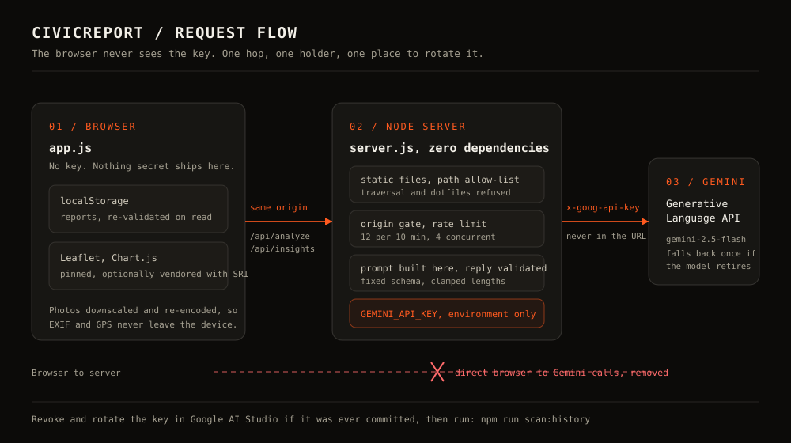

<div align="center">

# CivicReport

**Your city. Your voice.**

AI-assisted civic issue reporting for Berhampur, Odisha.
Photograph the problem, let the AI draft the report, watch the map hold the city to account.

[](LICENSE)
[](https://nodejs.org)
[](#why-there-are-no-dependencies)
[](#checks-and-tests)
[](SECURITY.md)

[Overview](#overview) · [Security](#security) · [Quick start](#quick-start) · [Configuration](#configuration) · [HTTP API](#http-api) · [Checks and tests](#checks-and-tests) · [Limitations](#current-limitations) · [Security policy](SECURITY.md)

</div>



## Overview

Reporting a broken streetlight in most Indian cities means a phone call, a queue and a form that nobody tracks. CivicReport is a working demonstration of the opposite: one photo, an AI-generated first draft, a shared map, and a visible status that residents can confirm for themselves.

It is built for Berhampur, but nothing is hardcoded to it beyond the city centre used to place reports without a location picker.

| Surface | What it does |
| :--- | :--- |
| **Report** | Upload a photo, let Gemini classify it, or fill the form in by hand. Photos are resized to 1280px and re-encoded in the browser, which also strips EXIF and GPS data. |
| **Live map** | Leaflet map with severity-coloured markers, a popup per report, and category filters. Wheel zoom stays disabled until the map is clicked, so page scrolling is never hijacked. |
| **Dashboard** | City health ring, issues by category (bar), status breakdown (doughnut), and per-category counts. |
| **Insights** | Gemini reads the aggregate counts on the page and returns up to four observations for authorities. Counts only, no names, descriptions or photos. |
| **Contribution** | Points for reporting, resolving and confirming, with a leaderboard. An engagement mechanic, not a municipal record. |
| **Ticker** | The newest reports, in a strip that pauses on hover or focus. |

Recorded walkthrough of the interface: [docs/media/demo-recording.mp4](docs/media/demo-recording.mp4) (MP4, 13 MB).

## Security

The short version: the API key is not in anything the browser downloads, and the AI endpoints cannot be used as a free proxy for someone else's model calls. Full detail lives in [SECURITY.md](SECURITY.md).

**The key is server-side.** Earlier commits in this repository put the Gemini key in a client-side `config.js` and called Google directly from `app.js`. Anyone could read it from the network tab or from a downloaded copy. That file no longer exists. `server.js` reads `GEMINI_API_KEY` from the process environment, sends it in the `x-goog-api-key` header, and the browser only ever talks to same-origin `/api/analyze` and `/api/insights`.

**The endpoints are constrained.**

- Prompts are built on the server. `/api/analyze` accepts an image and nothing else, and `/api/insights` accepts counts whose keys are matched against a whitelist and whose values are clamped to integers. No client text reaches the model.
- Images are identified by magic bytes, not by a client-declared MIME type.
- Requests must be same-origin: the `Origin` header must match `Host`, and a cross-site `Sec-Fetch-Site` value is rejected with 403.
- Rate limited to 12 AI requests per client per 10 minutes, 4 in flight, answered with 429 and `Retry-After`.
- Model replies are parsed, schema-checked, stripped of control characters, length-clamped and re-serialised before the browser sees them.

**Untrusted text is rendered as text.** Report text, model output and map popups are built from DOM nodes and written with `textContent`. No user-controlled value reaches `innerHTML`, and there are no inline `onclick` handlers, which is what lets the Content Security Policy forbid inline script entirely.

**Stored data is treated as hostile.** Reports live in `localStorage`, so every record is rebuilt through a whitelist on read: fixed category, severity and status lists, clamped numbers, coordinates bounded to the Berhampur area, and images restricted to a strict `data:image/(jpeg|png|webp);base64,...` pattern under a size ceiling.

**The server serves only what it means to.** One decode, no null bytes, no dotfiles, no `node_modules`, `tools`, `.git` or server-side source, and a resolved path that must stay inside the project root. Only allow-listed extensions are served, with `nosniff`.

**Credentials stay out of the repository.** `npm run scan` checks tracked and untracked files for Google, AWS, GitHub, Slack, OpenAI and Stripe credential shapes plus private key blocks, and `npm run scan:history` checks every commit. Both run in CI, along with a check that no key-shaped string exists in any client-facing file.

**Privacy is part of this.** No accounts, no cookies, no analytics, no third-party trackers. Photos are stripped of metadata before upload, and logs contain the request path, status and duration, never query strings, with rate-limit events recording a short hash of the client address rather than the address itself.

## Quick start

Node.js 20.6 or newer. Nothing to install, because there are no dependencies.

```bash
git clone https://github.com/ssambit635-svg/Civic-report.git
cd Civic-report
npm start
```

Open the address it prints, by default <http://localhost:3000>. Reports, the map, the dashboard and the leaderboard all work without any key configured. Photo analysis and insights need one:

```bash
cp .env.example .env
# add GEMINI_API_KEY, free from https://aistudio.google.com/apikey
npm run start:env
```

The key is read only by `server.js`. It is never bundled, never sent to the browser, and never logged.

### Running without the server

The front end is plain HTML, CSS and JavaScript, so it also runs as a static site from GitHub Pages, Netlify or even a local file. Everything works except the AI features, and the interface says so in the report panel instead of failing silently. The Node server is what keeps the key out of the browser, so a static deployment must not put one back in.

## Configuration

All settings are optional except the key. Copy `.env.example` to `.env`, or set them in the environment.

| Variable | Default | Purpose |
| :--- | :--- | :--- |
| `GEMINI_API_KEY` | none | Enables the AI routes. Get one from [Google AI Studio](https://aistudio.google.com/apikey) and restrict it to the Generative Language API. |
| `GEMINI_MODEL` | `gemini-2.5-flash` | Model for both AI routes. Retired names answer 404, and the server retries once against `gemini-flash-latest`. |
| `PORT` / `HOST` | `3000` / `0.0.0.0` | Listen address. `PORT=0` asks the OS for a free port. |
| `ALLOWED_FRAME_ANCESTORS` | `'self'` | CSP `frame-ancestors`. Widen it only when the app must render inside a host page. |
| `TRUST_PROXY` | `0` | Set to `1` only behind a proxy you control, otherwise clients can spoof `X-Forwarded-For` and dodge rate limits. |
| `ENABLE_HSTS` | `0` | Set to `1` once the app is served over HTTPS. |
| `RATE_LIMIT_MAX` / `RATE_LIMIT_WINDOW_MS` | `12` / `600000` | AI requests per client per window. |
| `MAX_CONCURRENT_AI` | `4` | AI requests in flight before 503. |
| `MAX_IMAGE_BYTES` / `MAX_JSON_BYTES` | `2500000` / `4000000` | Intake ceilings, checked after sniffing. |
| `UPSTREAM_TIMEOUT_MS` | `30000` | Gemini request timeout. |
| `NODE_ENV` | development | Set to `production` for the production log line. |

## HTTP API

Three endpoints, all same-origin. Errors are `{ "error": "code", "message": "human readable" }` with a stable `error` code so the client can respond precisely.

| Endpoint | Body | Success | Notes |
| :--- | :--- | :--- | :--- |
| `GET /api/health` | none | `{ ok, ai, model, limits }` | `ai` is false when no key is configured. Never returns the key. |
| `POST /api/analyze` | `{ image: { mimeType, data } }` | `{ analysis: { issue, severity, category, description, action, tags }, model }` | `data` is base64 without a data URL prefix. JPEG, PNG or WebP, verified by signature. |
| `POST /api/insights` | `{ summary: { total, resolved, open, inProgress, byCategory, bySeverity } }` | `{ insights: [{ title, text, tag, tagLabel }], model }` | Unknown keys are dropped; numbers are clamped. |

Error codes include `ai_unavailable` (503), `rate_limited` (429), `busy` (503), `cross_origin_blocked` (403), `image_unsupported_type` and `image_required` (400), `image_too_large` and `payload_too_large` (413), `unsupported_media_type` (415), `no_data` (400), `upstream_unreachable` and `upstream_timeout` (504), `analysis_failed` and `insights_failed` (502), and `internal_error` (500).

```bash
curl -s localhost:3000/api/health
curl -s -X POST localhost:3000/api/analyze \
  -H 'content-type: application/json' \
  -d "{\"image\":{\"mimeType\":\"image/jpeg\",\"data\":\"$(base64 -w0 photo.jpg)\"}}"
```

## Project structure

```text
CivicReport/
├── index.html              Single page, no inline script or styles
├── style.css               Design system, flat surfaces and one accent colour
├── app.js                  All browser logic. Contains no key and no innerHTML
├── server.js               Static host plus the Gemini proxy. Zero dependencies
├── .env.example            Environment template, copied to .env
├── SECURITY.md             Threat model, controls, known limitations
├── docs/
│   ├── architecture.svg    Request flow diagram used above
│   └── media/              Recorded walkthrough
├── tests/
│   └── security.test.mjs   Validation, headers, path allow-list, rate limiting
└── tools/
    ├── scan-secrets.mjs    Credential scanner for the tree and git history
    └── vendor-assets.mjs   Optional self-hosting of Leaflet and Chart.js with SRI
```

## Checks and tests

```bash
npm run check          # syntax check every JavaScript file
npm test               # 31 tests: validation, headers, paths, rate limiting
npm run scan           # credential scan of the working tree
npm run scan:history   # credential scan of every commit
npm run verify         # re-hash vendored assets against the lock file
```

`npm test` starts the server on an ephemeral port and exercises it over HTTP, including a separate child process with no key configured. It needs no network and no API key.

## Supply chain

The server has zero runtime dependencies, so there is no npm dependency tree to compromise in production. The two browser libraries are pinned to exact versions, always with an exact number and never a floating tag.

<a id="why-there-are-no-dependencies"></a>
Leaflet and Chart.js are loaded from their vendors' CDNs by default, which is convenient but means the page trusts two remote origins at runtime. `npm run vendor` downloads those exact pinned versions into `vendor/`, records their SHA-384 hashes in `vendor/assets.lock.json`, fails if a file that was recorded changes upstream, and rewrites `index.html` to load the local copies with `integrity` attributes. After running it, remove the `unpkg.com` and `cdn.jsdelivr.net` entries from the Content Security Policy in `server.js` and `index.html`.

## Deployment

1. Set `GEMINI_API_KEY` in the platform's secret manager or in `.env` on the host. Never in a build argument, an image layer or a committed file.
2. Terminate TLS in front of the server and set `ENABLE_HSTS=1`.
3. Set `TRUST_PROXY=1` only behind a proxy you control.
4. Keep `ALLOWED_FRAME_ANCESTORS='self'` unless the app must be embedded.
5. Run `npm run scan:history` once on any fork or clone that previously shipped a client-side key, and revoke anything it finds.
6. Run the service as a non-root user. It writes nothing to disk and needs no filesystem access beyond its own directory.

## Current limitations

Stated plainly, because a civic tool that overstates itself is worse than useless.

- **There is no backend and no authentication.** Reports, confirmations and status changes live in one browser's `localStorage`. The community figures are a demonstration. Two people do not see each other's reports.
- **Anyone can change any status from their own copy.** Fine for a prototype, unacceptable for a real record.
- **Both AI routes are unauthenticated.** They are rate limited and same-origin gated, but a determined person on rotating addresses can still spend the free quota. Put the app behind an authenticated proxy before exposing it publicly.
- **Rate limiting is per process.** It resets on restart and is not shared across instances.
- **Map tiles and fonts come from third parties** (CARTO, OpenStreetMap, Google Fonts), which reveals the area being viewed to those providers. Self-hosting both removes it.
- **Photos go to Google** when AI features are used, under Google's API terms. The feature is optional and the interface says so.
- **The health score is a heuristic**, not a municipal metric. It is computed from severity weights and resolution share in the browser.

## Roadmap

- [ ] Real backend with accounts, so reports are shared and attributable
- [ ] Authority dashboard with assignment and audit trail
- [ ] Photo storage with moderation instead of base64 in `localStorage`
- [ ] Offline capture for low-connectivity areas
- [ ] Odia and Hindi interface
- [ ] SMS intake for residents without smartphones
- [ ] Municipal API integration for status feeds

## Built with

| Piece | Role |
| :--- | :--- |
| Node.js standard library | HTTP server, gzip, static files, Gemini proxy. No framework, no dependencies |
| Google Gemini API | Photo classification and aggregate insights, called only from the server |
| Leaflet and OpenStreetMap | Map rendering and tiles |
| Chart.js | Dashboard charts |
| Space Grotesk, Inter, JetBrains Mono | Typography |

## License

MIT. See [LICENSE](LICENSE). Third-party assets keep their own licences, listed in `vendor/README.md` after running `npm run vendor`.

## Author

**Sambit Swain**, first year B.Tech Computer Science, NIST University, Berhampur.

[](https://github.com/ssambit635-svg)
[](https://www.linkedin.com/in/sambit-swain-7032a8378)

Security reports go through the [private advisory form](https://github.com/ssambit635-svg/Civic-report/security/advisories/new), never a public issue.
